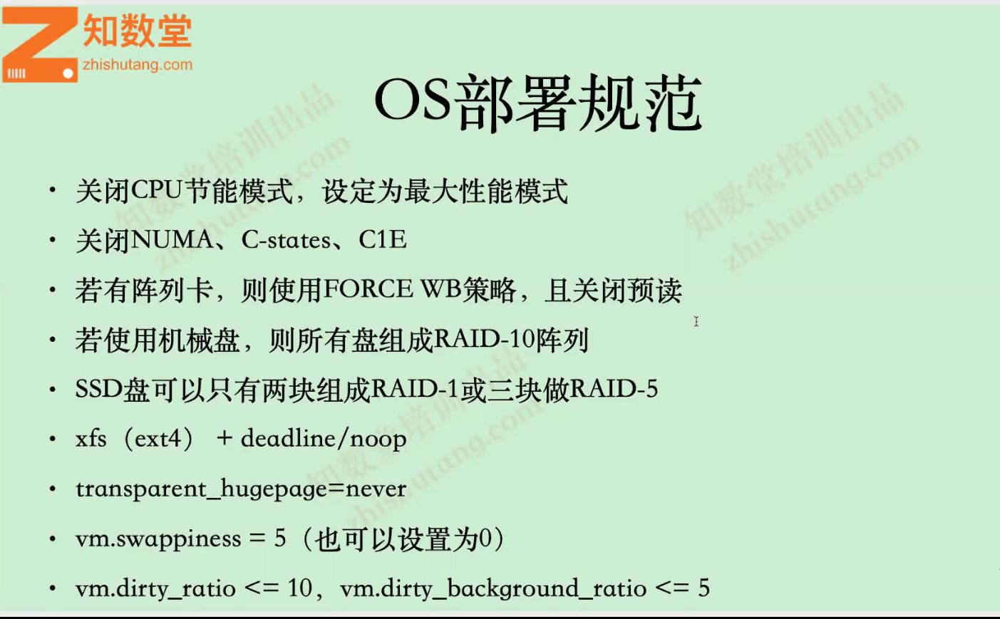
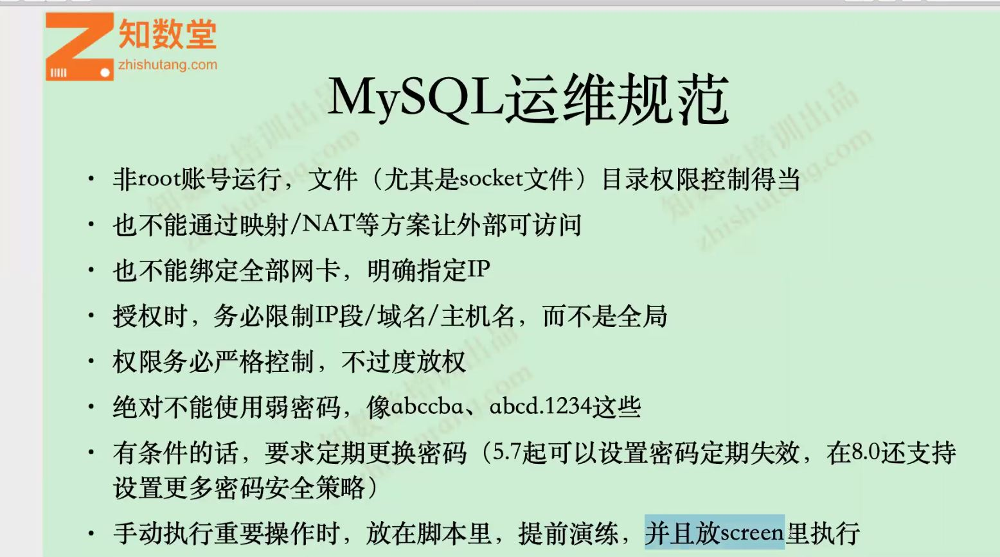
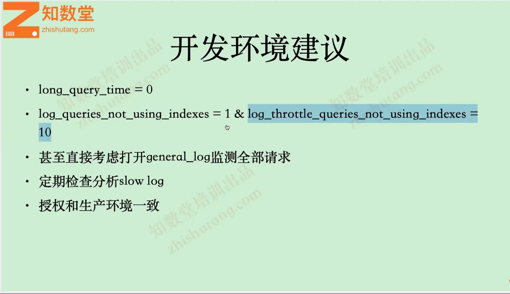
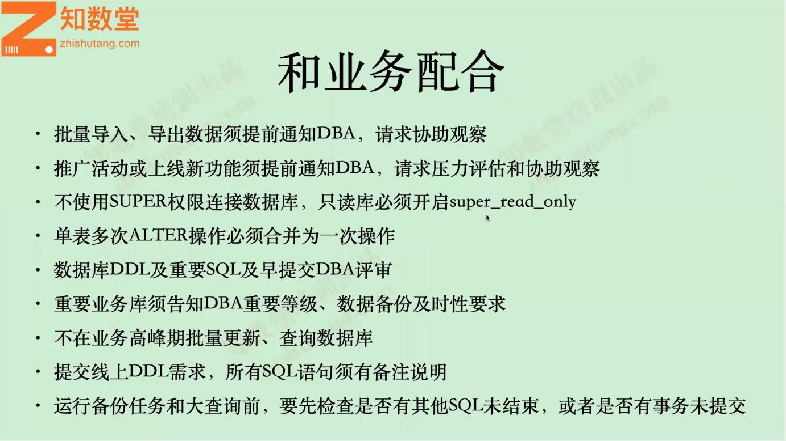

# OS部署规范

- 关闭CPU节能模式，设为最性能模式  
```dmesg -T|grep -i  'power.*sav' ```
- 关闭numa，C-states，C1E
- 若有阵列卡，则使用force wb策略，且关闭预读
- 若使用机械盘，则所有盘组成RAID-10阵列
- SSD盘可以只有两块RIAD-1或三块做RAID-5(使用fio测试工具对磁盘iops进行测试)
- xfs+deadline/noop
- vm.swappiness=5
- vm.dirty_ratio=10,vm.dirty\_background\_ratio=5

	
# MySQL运维规范
- 非root账户运行，文件(尤其是socket文件)目录权限控制得当
- 也不能通过隐射/NAT等方案让外部可访问
- 也不不能绑定全部网卡,明确指定IP
- 授权时,务必限制IP/域名/主机名,而不是全局
- 权限务必严格控制,不过渡放权
- 对不能使用弱密码
- 有条件的话,要求定期更换密码(5.7起可以设置密码定期失效,在8.0还支持设置更多的密码安全策略)
- 手动执行重要操作时,放在脚本里,提前演练,并且放creen里面执行
- mysqladmin var|grep -i '参数名称'  , mysqladmin ext|grep -i '参数名称'   


# 开发环境建议  

<pre>
long_query_time=0  慢查询时间,0表示全部记录,如果为0下面两个参数没有意义
log_queries_not_using_indexes=1  没有使用索引的SQL全部记录
log_throttle_queries_not_using_indexes=10 没有使用索引的SQL每分钟记录10条
</pre>
- 可以考虑打开general_log监控
- 定期检查分析slow_log(pt-query-digest)
- 授权和生产环境一致

# 和业务配合
- 批量导入,导出数据必须提前通知DBA,请求协助观察
- 推广活动或上线新功能须提前通知DBA,请求压力测试评估和协助观察
- 不使用super权限连接数据库,只读库必须开启super_read_only
- 单标多次alter操作必须合并为一次操作
- 数据库DDL及重要SQL需提前交DBA审核
- 重要业务库必须告知DBA重要等级,数据备份及时性要求
- 不在业务高峰期批量更新,查询数据库
- 提交线上DDL需求,所有SQL语句必须有备注说明
- 运行备份任务和大查询前,要先检查是否有其他SQL未结束

# 和业务配合
- 定期全备(最好每天至少一次)
- 备份方式:物理+逻辑
- binglog也需要备份
- 很重要的两点:
	- 异地备份
	- 备份文件恢复测试
	- 有条件的话,对备份数据加密
	
# 重要的开发规范
- 使用InnoDB表,并且InnoDB表一定要有显式的主键
- 最好选择自增ID作为InnoDB表主键
- 不要在数据库里面做运算(尤其是表达式,函数,浮点数)
- 尽可能不用text/blob类型,非要用的话,拆分到外部表再关联起来
- 边约窄越好(整个表实际存储的列的长度不要超过200字节),所有列数据类型尽可能小
- 重要业务SQL先查看执行计划后再创建合适的索引,不要瞎建索引
- 不要对字符串,长文本全部长度加索引,要么先哈希,要么部分索引
- 不要在where条件中用rand()函数,很大概率会造成全表扫描


# MySQL关键参数
  


<pre>
innodb_flush_sync =0 如果设置1 下面两个参数设置将无效
innodb_io_capacity
innodb_io_capacity_max
</pre>


# MySQL关键指标

- 等待事件
- 排序全表扫描次数
- 慢查询
- 临时表和临时文件

  


# 本节小结
- 选择(CPU,内存)最大性能模式运行MySQL,并且关闭NUMA
- 选用搞性能I/O设备运行MySQL
- 选择linux系统,配合xfs+deadline/noop环境
- 做好数据库的网络信息安全防范
- 做好数据库备份&恢复测试,防止发生意外
- 重要性操作前谨慎再谨慎


# 学习方法
  

# 提问艺术
  