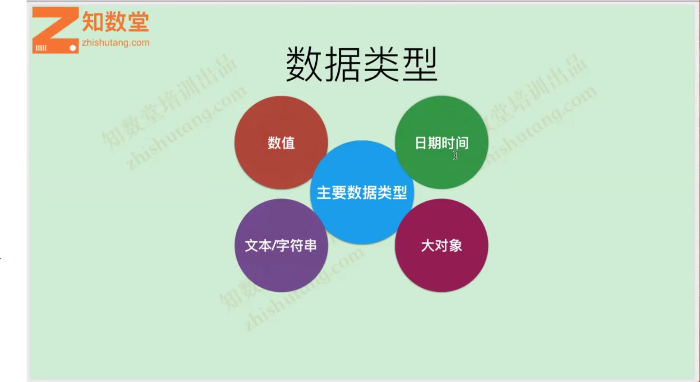
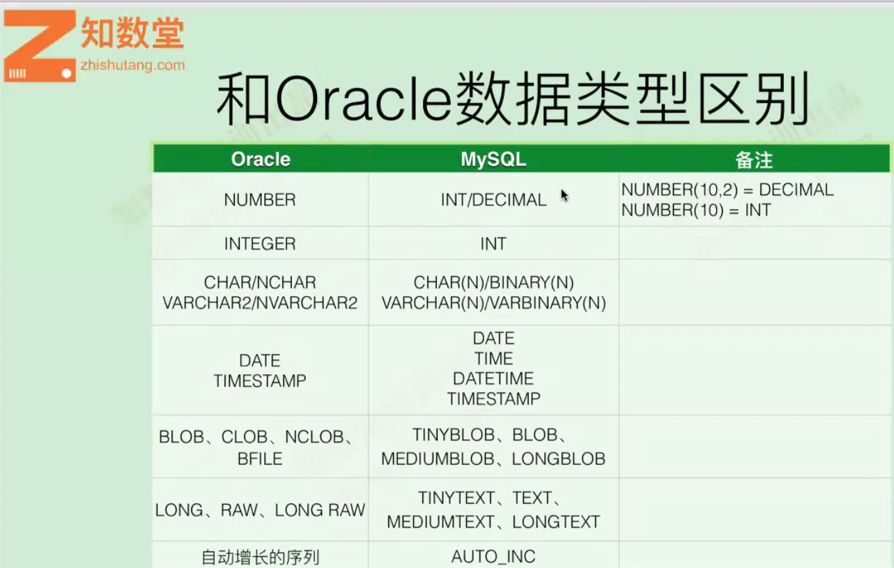
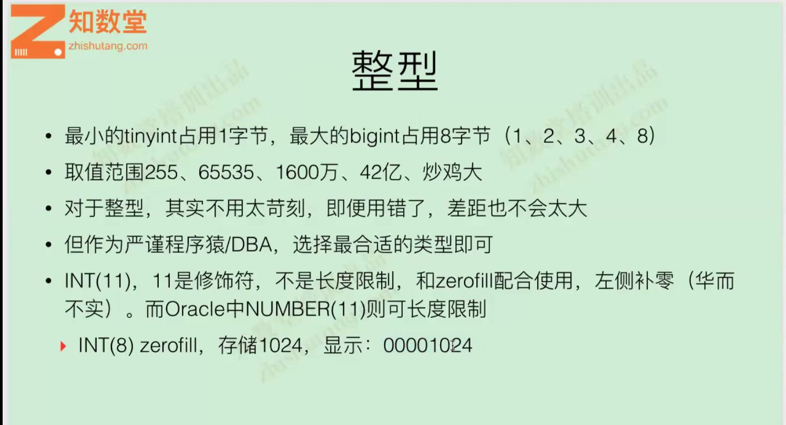
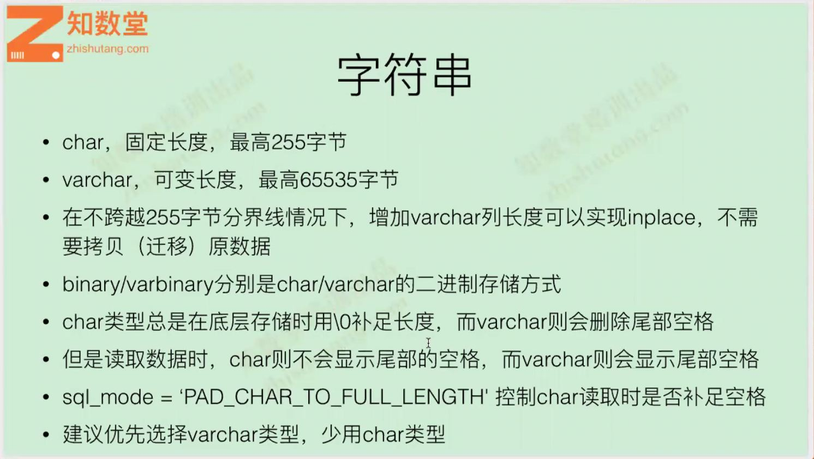
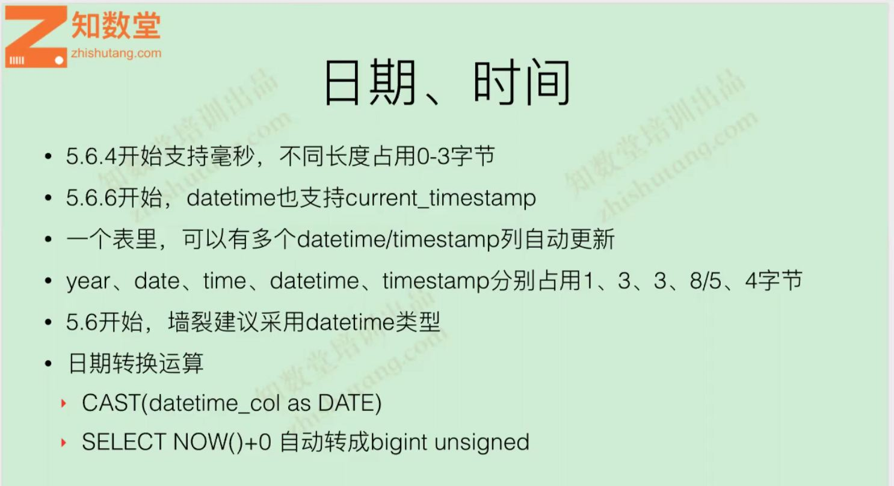
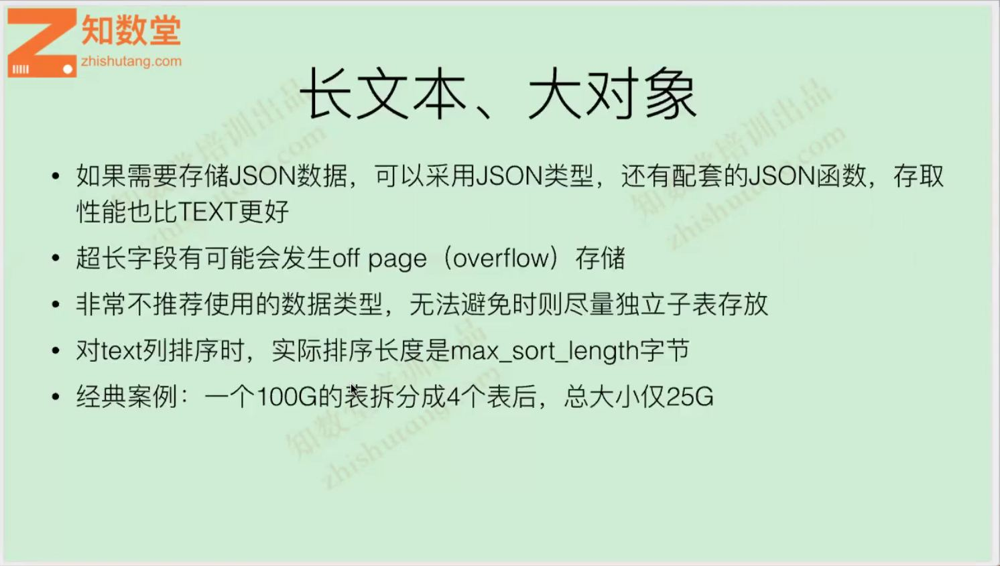
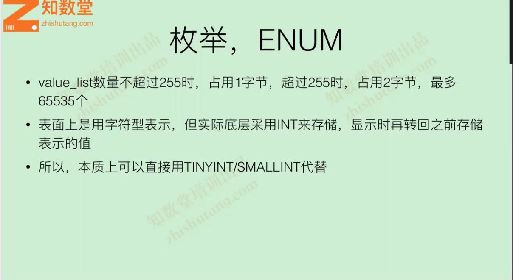
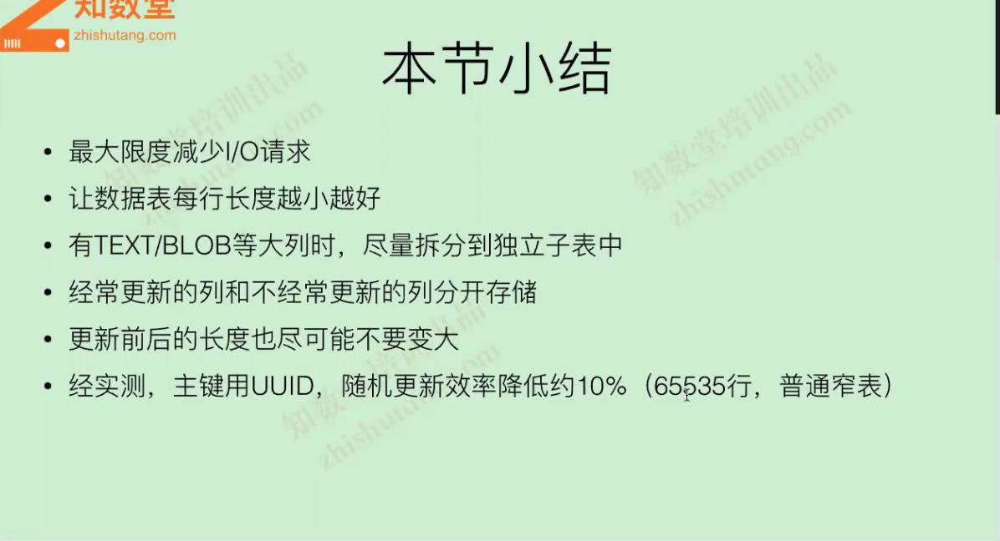

# MySQL数据类型
   
- 整型
- 字符型
- 日期时间型
## Oracle和MySQL类型对比
   

## 整型
   
```
1. 最小的tinyint占用一个字节,最大的bigint占用8个字节(1,2,3,4,8)
   最常用的为int,bigint,tinyint
2. 对于整形,其实不用太苛刻,即使用错了,差距也不会特别大
   但是作为程序猿DBA,选择最合适的类型即可
3. int(11),11是修饰符,不是长度限制,和zerofill配合使用,左侧补0;而Oracle中number(11)则是存储长度的现在
   int(8) zerofill,存储1024,显示:00001024

总结:几个整形的数据类型性能差异不是特别大,基本上可以放心使用  
测试范围:
select cast(0 as unsigned) -1 
ERROR 1690 (22003): BIGINT UNSIGNED value is out of range in '(cast(0 as unsigned) - 1)'
select 9223372036854775807 + 1;
ERROR 1690 (22003): BIGINT value is out of range in '(9223372036854775807 + 1)'
select cast(9223372036854775807 as unsigned) + 1;
mysqlslap -S  /tmp/mysql3306.sock  --no-drop --create-schema  pressure --number-of-queries 1000 -q "select * from sbtest1 where id=round(rand()*2036172918);"

"知数堂/老叶茶馆"公众号的历史文章中查找
1. char和varchar存取的差别
2. 简单几招提高MySQL安全性
3. 说说MySQL,order by
4. 多属性,多分类的MySQL设计模式
   
   
   
mysqlslap -S  /tmp/mysql3306.sock  --no-drop --create-schema  pressure --number-of-queries 1000 -q "select * from sbtest1 where id=round(rand()*2036172918);"
```
    
  
## 字符串

```
1. char固定长度,最高255个字符
2. varchar可变长度,最高65535个字节,需要额外1-2个字节存储该列的长度(整体而言,其实这个代价很小)
   理论上,一个表中所有的varchar列的总可以用长度也是65535个字节;但实际上是65533,因为要减去1-2个字节
3. 在不跨越255字节分界线情况下,增加varchar列长跨越实现inplace,不需要拷贝(迁移)源数据
	varchar类型中有个标志位,在存储少于255个字节的时候,用一个字节来表示该列的长度,大于255需要2个字节来表示该列的长度;所以在增加列长度跨越255个字节的时候,标志位就会发生变化,这样相对起来成本是比较大的
4. binary/varbinary分别是char/varchar的二进制存储方式
5. CHAR在底层存储的时候总是会补足空格后再存储，不管用户插入数据时尾部有没有包含空格
   VARCHAR在底层存储的时候不会先补足空格后再存储，但如果是用户在插入时特地加了空格那就会如实存储，而不会给删除。
   读取数据时，CHAR总是会删除尾部空格（哪怕是写入时包含空格）
   读取数据时，VARCHAR总是如实取出之前存入的值（如果存储时尾部包含空格，就会继续保留着，不会像CHAR那样删除尾部空格）
  sql_mode='PAD_CHAR_TO_FULL_LENGTH'控制char读取是否补足空格
6. 建议优先选择varchar类型,少用char类型

字符集:
1. varchar是变长类型,需要额外1-2字节(整体而言,其实这个代价很小)
2. 理论上,一个表中所有varchar列的总可用长度是65535个字节,但是实际上是65533个字节,因为要减去上述提及的1-2个字节
3. 字符集(charset),字符串的编码规则
4. 校验集(collation),定义字符排序的顺序,控制各个字符和字符串如何比较规则
5. MySQL8.0开始,默认使用utf8mb4字符集(5.7默认采用的是utf8mb3)
6. 字符集是utf8mb4时,实际可以存储字符数:FLOOR(65533/4)=16383

实际存储字节是:字符数\*字符集字节数
字符字节数:ASCII为一个字节,汉字为三个字节,高位汉字是四个字节;由于存在这种情况,所以varchar在字符集为utf8mb4的情况下,由于不能预估其准确的字节,默认统一采取4个字节作为存储
一个ASCII字符,采用常见的字符集编码(latin1\gbk\uft8\utf8mb4)时,只需要占用1个字节
一个中文字符,采用常见的字符集编码(latin1\gbk\uft8\utf8mb4)时,只需要占用2-4个字节

小结:
1. 优先使用varchar
2. 实际存储长度越小越好
3. 不要变长(enlarge)更新,尤其是不要跨越255字节的更新
4. 字符串列,尽量不要对整列创建索引(一定需要创建,使用前置索引或部分索引)

```

## 日期类型
  
```
1. 5.6.4开始支持毫秒,不同长度占用0-3个字节
2. 5.6.6开始,datetime也支持current_timestamp;一个表里面也可以有多个datetime/timestamp列更新
3. 5.6开始墙裂建议使用datetime类型
4. 日期转换运算
	cast(datetime_col as date)
	select now()+0 自动转换成bigint unsigned
	如果是20190922102551这样的数值表示日期,可以直接使用bigint unsigned存储,效率更高

```

## 长文本,大对象
  
```
1. 如果需要存储json数据,可用采用json类型,还有配套的json函数,存储性能也比text更好
1. 在InnoDB引擎中BLOB、TEXT或者长VARCHAR列可能会发生off page(overflow)存储
2. 非常不推荐使用此数据类型,如果无法避免则尽量独立于字表中
3. 对于text列排序时,实际排序的长度是max_sort_length字节

小节:
墙裂不建议使用此数据类型,如果一定要使用,建议不要存储太别的数据
个人建议一个表中所有列实际长度加起来不要超过200个字节,

```
[参考资料](https://imysql.com/2014/09/28/mysql-optimization-case-blob-stored-in-innodb-optimization.shtml)


## 浮点型
```
1. 互联网尽量不要采取浮点数,如金额可用转换为整形转换为分进行存储
2. 如果一定要使用统统使用decimal即可
3. float & double分别占用4和8个字节
4. decimal(M,D)
   精确的十进制浮点型,搞精度计算
   M最大65(默认10),D最大30(默认0)
   占用4-30个字节
   M：整数部位+小数部位
   D：小数部位


```

## 枚举类型
  
```
1. value_list数量不超过255,占用1个字节,超过255时,占用2个字节,最多65535个
2. 表面上是用字符型表示,但实际上底层采用INT来存储,显示时候再转回之前存储表示的值
3. 所有,本质上可以直接用TINYINT/SMALLINT代替

```

### json类型
   


### 本节小结

  


## 数据类型的隐式转换

   

- 所有where条件传值时,都要加上引号
- 进行条件比较时候,数据类型需要一样 