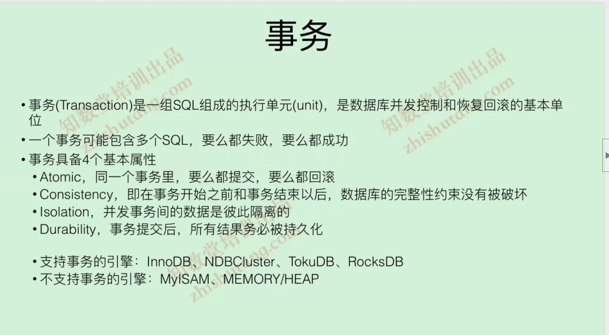
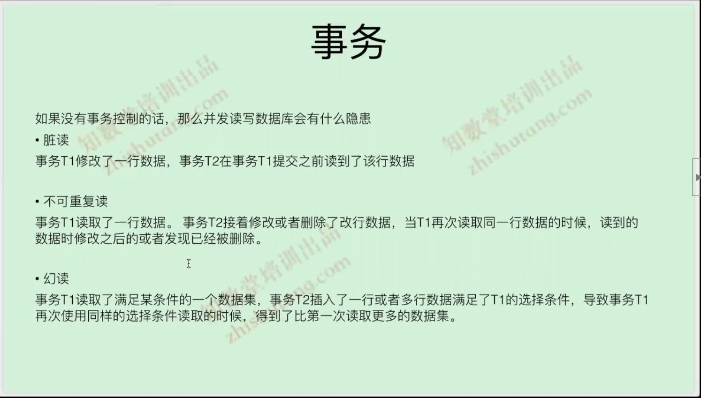
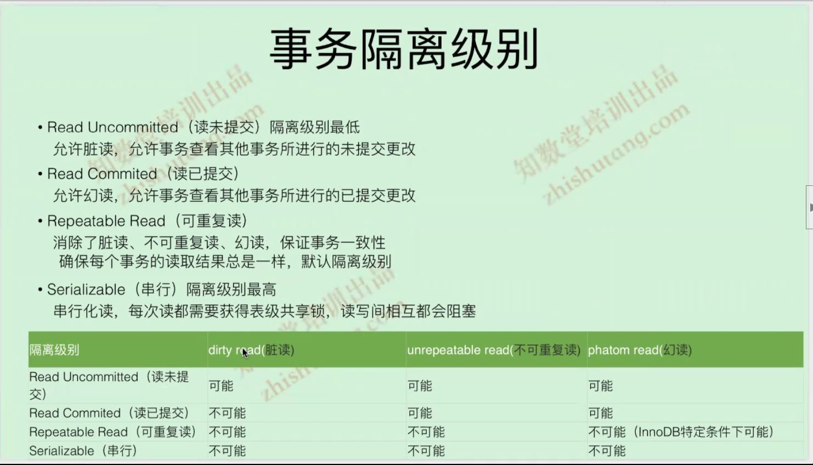

# 事务

## 事务
   
   
   
   
   


## 事务隔离级别
```
innodb_locks_unsafe_for_binlog=1 在5.7下面即使设置了RR隔离级别,也会发生幻读
GLOBAL 关键字是可以修改全局的设置，用这个方式修改完后，已经存在的连接还不会生效，只有对新建立的连接才会起作用。
而指定 SESSION 关键字则是只修改当前连接会话的设置，修改完后立即生效，再次连接后会恢复成全局的设置，对其他连接/会话也不起作用。
如果都不指定 GLOBAL、SESSION 关键字采用这种方式设置后，本次连接当前事务还未起作用，要到下一个(尚未启动的)新事务才起作用，下一个事务结束后，又将恢复成本次 SESSION中原先的设置
```
## 事务隔离级别
   

## InnoDB读

   
   


RC隔离级别下面,每个有效的sql都会创建快照版本
RR隔离级别下,每个事务的第一个有效的sql才会创建快照版本


[MySQL两阶段提交串讲](https://www.cnblogs.com/ZhuChangwu/p/14255838.html)


