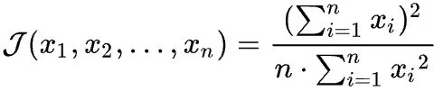

# 常用视图

```
查询无主键表
create view test.view_no_pk
as
select concat(t.table_schema,'.',t.TABLE_NAME) as tablename
from information_schema.tables t left join (select CONSTRAINT_SCHEMA,table_name from information_schema.TABLE_CONSTRAINTS where CONSTRAINT_TYPE='PRIMARY KEY') p
on t.table_name=p.table_name and t.TABLE_SCHEMA=p.CONSTRAINT_SCHEMA
where t.table_schema not in ('performance_schema','information_schema','mysql')
and p.table_name is null and t.TABLE_TYPE='BASE TABLE' ;

查询非innodb引擎
create view test.view_no_innodb
as
SELECT table_schema, table_name,engine FROM information_schema.tables WHERE engine <> 'InnoDB' AND table_schema NOT IN ('mysql' ,'performance_schema','information_schema');


update performance_schema.setup_consumers set ENABLED='YES' where NAME='global_instrumentation';
SELECT  *   FROM  performance_schema.setup_consumers WHERE NAME='global_instrumentation';
update performance_schema.setup_instruments set ENABLED='YES' where NAME='wait/lock/metadata/sql/mdl';
SELECT  * FROM   performance_schema.setup_instruments WHERE NAME='wait/lock/metadata/sql/mdl';

查询持有锁和sql的进程 5.7/8.0
create view test.view_dml1
as   
 select t1.id, t2.thread_id, t3.sql_text,t1.state,t5.command
      from information_schema.processlist t1, 
           performance_schema.threads t2,
           performance_schema.events_statements_current t3,
		   performance_schema.metadata_locks t4,
		   sys.session t5
     where t1.id in(select t1.ID from information_schema.processlist t1) and t1.id<>connection_id()
       and t1.id=t2.processlist_id 
       and t2.thread_id = t3.thread_id
	   and t3.thread_id = t4.OWNER_THREAD_ID
	   and t4.OWNER_THREAD_ID=t5.thd_id
	   group by t1.id ,t2.thread_id , t3.sql_text, t1.state,t5.command;
	   
	   
MySQL 5.6	   
 select t1.id, t2.thread_id, t3.sql_text
      from information_schema.processlist t1, 
           performance_schema.threads t2,
           performance_schema.events_statements_current t3
		   
     where t1.id in(select t1.ID from information_schema.processlist t1) and t1.id<>connection_id()
       and t1.id=t2.processlist_id 
       and t2.thread_id = t3.thread_id;
	   
	   
	   
如何定位 DDL 被阻塞的问题
MySQL 5.7，MySQL 8.0
SELECT sql_kill_blocking_connection
FROM sys.schema_table_lock_waits
WHERE blocking_lock_type <> 'SHARED_UPGRADABLE'
AND (waiting_query LIKE 'alter%'
OR waiting_query LIKE 'create%'
OR waiting_query LIKE 'drop%'
OR waiting_query LIKE 'truncate%'
OR waiting_query LIKE 'rename%');


MySQL 5.6
SELECT sql_kill_blocking_connection
FROM sys.schema_table_lock_waits
WHERE blocking_lock_type <> 'SHARED_UPGRADABLE'
AND (waiting_query LIKE 'alter%'
OR waiting_query LIKE 'create%'
OR waiting_query LIKE 'drop%'
OR waiting_query LIKE 'truncate%'
OR waiting_query LIKE 'rename%');
SELECT concat('kill ', i.trx_mysql_thread_id, ';')
FROM information_schema.innodb_trx i, (
SELECT MAX(time) AS max_time
FROM information_schema.processlist
WHERE state = 'Waiting for table metadata lock'
AND (info LIKE 'alter%'
OR info LIKE 'create%'
OR info LIKE 'drop%'
OR info LIKE 'truncate%'
OR info LIKE 'rename%'
)) p
WHERE timestampdiff(second, i.trx_started, now()) > p.max_time;  
	   
	   
	   
	   
call sys.ps_setup_enable_consumer('events_transactions%');

call sys.ps_setup_enable_instrument('transaction');

将公式转换为 SQL 语句如下
select ROUND(POWER(SUM(trx_summary.COUNT_STAR), 2) /

(@@GLOBAL.slave_parallel_workers * SUM(POWER(trx_summary.COUNT_STAR, 2))), 2) AS replica_jain_index

from performance_schema.events_transactions_summary_by_thread_by_event_name as trx_summary join performance_schema.replication_applier_status_by_worker as applier

on trx_summary.THREAD_ID = applier.THREAD_ID;


mysql内存 全局内存+线程内存

全局内存

create view test.view_gm
as 
select 
concat((select sum(VARIABLE_VALUE) from global_variables  where variable_name in ('innodb_buffer_pool_size','innodb_l
og_buffer_size','innodb_additional_mem_pool_size','key_buffer_size','query
_cache_size'))/1024/1024,"M") gm;

线程内存
select 
concat((select sum(VARIABLE_VALUE) from global_variables  where variable_name in ('read_buffer_size','read_rnd_buffer_size','sort_buffer_size','join_buffer_size','binlog_cache_size','tmp_table_size'))/1024/1024,"M") sm;


查询表碎片
SELECT TABLE_SCHEMA,TABLE_NAME,ENGINE,DATA_FREE,TABLE_ROWS,DATA_LENGTH,INDEX_LENGTH,(DATA_LENGTH+INDEX_LENGTH) as length,concat(round((DATA_LENGTH+INDEX_LENGTH)/1024/1024,3), 'MB') as total_size FROM information_schema.TABLES where TABLE_SCHEMA not in ('mysql','sys','performance_schema','information_schema') order by length desc ;
```


	


