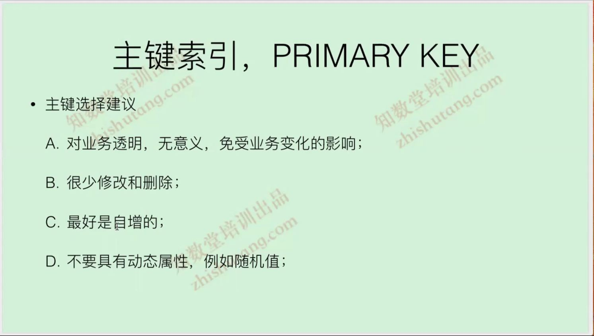

# 索引

## B+tree
   
   
   

## hash索引
- 大量唯一等值查询,hash索引效率通常比B+tree高
- hash索引不支持模糊查询
- hash索引不支持联合索引中的最左匹配的原则
- hash索引不支持排序
- hash索引不支持范围查询
- hash索引只能显式应用于heap/memory,ndb表,InnoDB表是不支持,在InnoDB引擎中底层依然是B+tree

## 索引
   
   
   
   


## 索引分类
   
   
   
   
   
   
   
   
   
   
  
  
  
  
  
   


## 索引长度
   

## 索引的管理和使用

- 约束相关操作
```
主键约束
alter table tb_name add primary key(id);
alter table tb_name drop primary key;

唯一约束
alter table tb_name add unique key(uid);
alter table tb_name drop key key_name;

普通约束
alter table tb_name add  key(uid) |USING HASH;
或
alter table tb_name add  key key_name(uid)|USING HASH;
alter table tb_name drop key key_name;

```

  
  
  
  
  


[更多新特性玩法](http://dev.mysql.com/doc/refman/8.0/optimizer-hints.html)


## 查询索引的使用率
  
  


[索引更多信息](https://www.cnblogs.com/allenhu320/p/11365049.html)


什么是回滚段:用来保存数据变化前映像而提供一致读和保障事务完整性的一段磁盘存储区域   
[innod架构体系](https://zhuanlan.zhihu.com/p/90655027)   


[MVCC实现原理](https://blog.51cto.com/12182612/2486731#:~:text=%E5%A4%9A%E7%89%88%E6%9C%AC%E5%B9%B6%E5%8F%91%E6%8E%A7%E5%88%B6%EF%BC%88MVCC%EF%BC%89%E6%98%AF%E4%B8%80%E7%A7%8D%E7%94%A8%E6%9D%A5%E8%A7%A3%E5%86%B3%E8%AF%BB-%E5%86%99%E5%86%B2%E7%AA%81%E7%9A%84%E6%97%A0%E9%94%81%E5%B9%B6%E5%8F%91%E6%8E%A7%E5%88%B6%EF%BC%8C%E4%B9%9F%E5%B0%B1%E6%98%AF%E4%B8%BA%E4%BA%8B%E5%8A%A1%E5%88%86%E9%85%8D%E5%8D%95%E5%90%91%E5%A2%9E%E9%95%BF%E7%9A%84%E6%97%B6%E9%97%B4%E6%88%B3%EF%BC%8C,%E4%B8%BA%E6%AF%8F%E4%B8%AA%E4%BF%AE%E6%94%B9%E4%BF%9D%E5%AD%98%E4%B8%80%E4%B8%AA%E7%89%88%E6%9C%AC%EF%BC%8C%E7%89%88%E6%9C%AC%E4%B8%8E%E4%BA%8B%E5%8A%A1%E6%97%B6%E9%97%B4%E6%88%B3%E5%85%B3%E8%81%94%EF%BC%8C%E8%AF%BB%E6%93%8D%E4%BD%9C%E5%8F%AA%E8%AF%BB%E8%AF%A5%E4%BA%8B%E5%8A%A1%E5%BC%80%E5%A7%8B%E5%89%8D%E7%9A%84%E6%95%B0%E6%8D%AE%E5%BA%93%E7%9A%84%E5%BF%AB%E7%85%A7%20%E3%80%82)