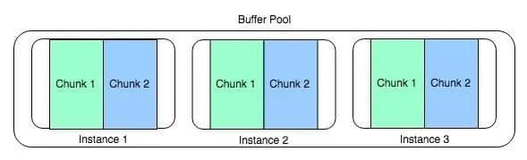
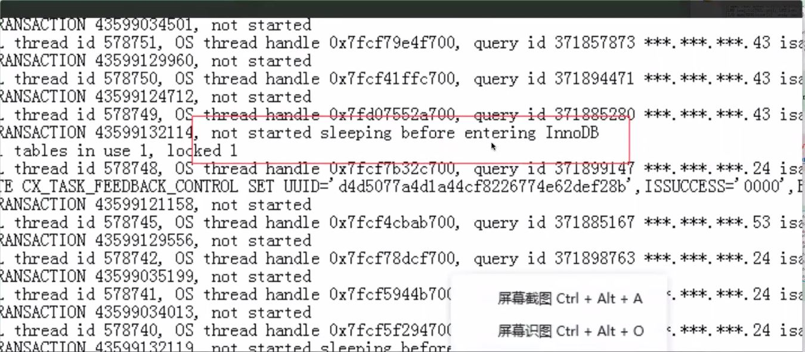

# 课程中整理的参数

[my.cnf生成器](https://imysql.com/my-cnf-wizard.html)  
buffer_pool参数
```
innodb_buffer_pool_size 参数为innodb_buffer_pool的大小设置,一般物理内存的50%-70%
innodb_buffer_pool_chunk_size参数为InnoDB缓冲池块大小。
innodb_buffer_pool_instances参数为缓冲池实例的个数。

```
 


慢查询参数
<pre>
long_query_time=0  慢查询时间,0表示全部记录,如果为0下面两个参数没有意义
log_queries_not_using_indexes=1  没有使用索引的SQL全部记录
log_throttle_queries_not_using_indexes=10 没有使用索引的SQL每分钟记录10条
</pre>


关键性的参数说明

```
key_buffer_size=8M MyISAM表的是用于索引块的缓冲区的大小
sort|join|read|read_rnd_buffer_size 
    select /*+set_var(sort_buffer_size=10485760)*/ * from 8.0开始支持新的语法
    每个必须执行排序的会话都会分配此大小的缓冲区
    用于普通索引扫描，范围索引扫描和不使用索引的联接的缓冲区的最小大小
    对MyISAM表进行顺序扫描的每个线程都会为其扫描的每个表分配此大小（以字节为单位）的缓冲区
    此变量用于从MyISAM表读取，并且对于任何存储引擎，用于多范围读取优化

tmp_table|max_heap_size=96M 
    内部内存临时表的最大大小,实际限制由tmp_table_size和max_heap_table_size中的较小值确定,默认16M
binlog_format=row
long_query_time=0.01-0.05
log_queries_not_using_indexes=1 
log_throttle_queries_not_using_indexes=10 
wait_timeout=300				
interactive_timeout=300
    内部来讲只有wait_timeout参数会传递到网络层设置，而interactive_timeout参数只会在会话登陆的时候判断是否是交互式客户端会话如果是
    则进行wait_timeout=interactive_timeout的覆盖，如果不是则不生效的。
    一旦会话登陆成功如果想要会话级别修改超时参数，不管交互式还是非交互式都是修改wait_timeout(set wait_timeout)参数才会生效
    
lock_wait_timeout=3600
    此超时适用于所有使用元数据锁的语句。其中包括对表，视图，存储过程和存储函数的DML和DDL操作，以及LOCK TABLES，具有READ LOCK的FLUSH TABLES和HANDLER语句。
log_error_verbosity=3
sql_safe_updates=1
default_time_zone='+8:00' 
sysnc_binlog=1
innodb_flush_log_at_trx_commit=1

innodb_data_file_path =ibdata1:1024M:autoextend
innodb_log_buffer_size   建议物理内存的50%-80%
innodb_max_dirty_pages_pct  建议不超过50%
innodb_log_buffer_size 建议32M
innodb_thread_concurrency=0   InnoDB线程的并发数(show engine innodb status中TRANSACTIONS段中有报错信息为:not started sleeping before entering innodb )
innodb_lock_wait_timeout=5-10
innodb_log_buffer_size=2G
innodb_log_files_in_group=4-8
innodb_flush_sync=0
innodb_io_capacity  && innodb_io_capacity_max 根据IO性能调整(innodb_flush_sync开启后,此参数将无意义)
innodb_autoinc_lock_mode=2   设置为2时候需要设置binlog_format=row才能放心使用
```
 


```
innodb_sort_buffer_size 指定在创建InnoDB索引期间用于对数据进行排序的排序缓冲区的大小,该排序区域仅在索引创建期间用于合并排序，而不在以后的索引维护操作期间用于合并排序。索引创建完成后，将释放缓冲区
myisam_sort_buffer_size 在REPAIR TABLE期间对MyISAM索引排序或使用CREATE INDEX或ALTER TABLE创建索引时分配的缓冲区大小。
preload_buffer_size 预加载索引时分配的缓冲区大小。
innodb_log_buffer_size InnoDB用于写入磁盘上的日志文件的缓冲区大小（以字节为单位）。 默认值为16MB
clone_buffer_size 定义在本地克隆操作期间传输数据时使用的中间缓冲区的大小。 此设置不适用于远程克隆操作
bulk_insert_buffer_size 和key_buffer_size一样，这个参数同样也仅作用于使用 MyISAM存储引擎，用来缓存批量插入数据的时候临时缓存写入数据
```


```

Innodb_buffer_pool_read_ahead:后台预读线程读取信息到buffer里的次数
Innodb_buffer_pool_read_ahead_evicted:预读页，但是在buffer中没有被读去，就从buffer被刷出页的数量，一般可以判断预读页的效率
Innodb_buffer_pool_read_requests:从bufffer pool中读取页的次数
Innodb_buffer_pool_reads:直接从物理盘读取页的次数
Innodb_data_read:The amount of data read since the server was started.
Innodb_data_reads:The total number of data reads.

buffer pool命中率=Innodb_buffer_pool_read_requests/(Innodb_buffer_pool_read_requests+Innodb_buffer_pool_reads+Innodb_buffer_pool_read_ahead)
平均每次读取的字节数=Innodb_data_read/Innodb_data_reads

```