# 锁
[参考资料](https://database.51cto.com/art/201910/604421.htm)   

## 锁的基本概念
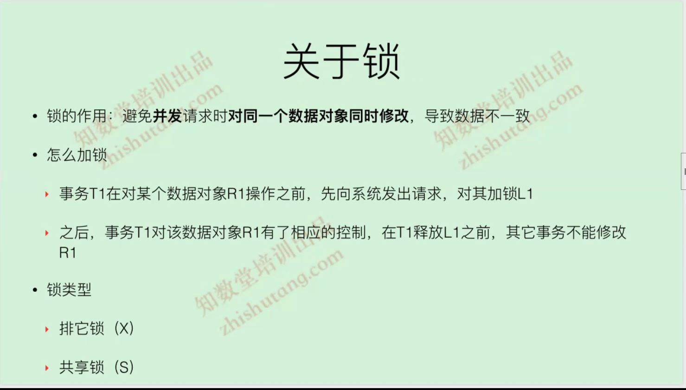  
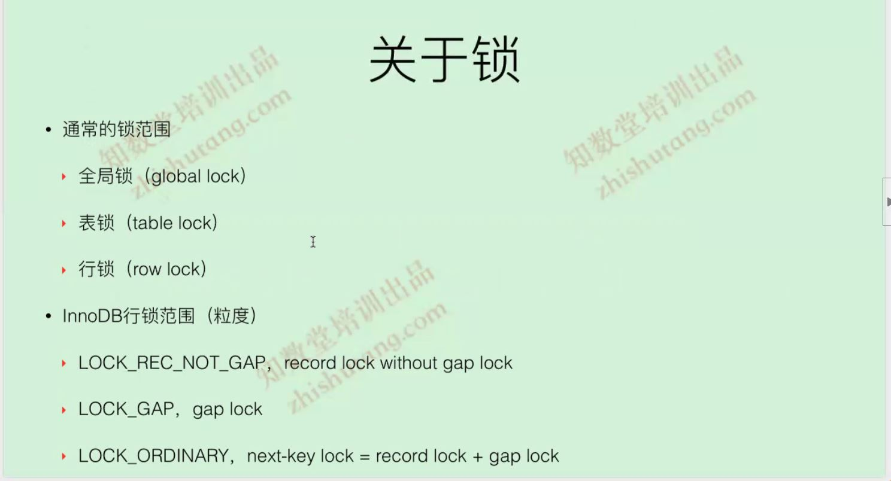  
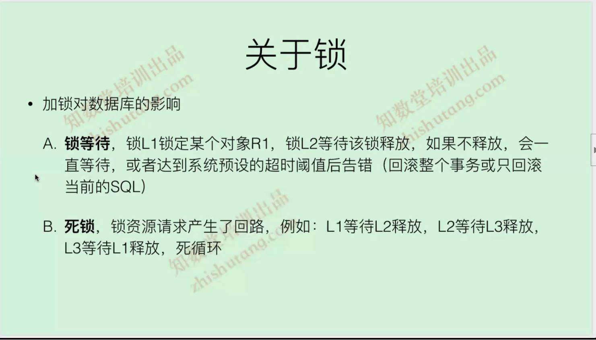  
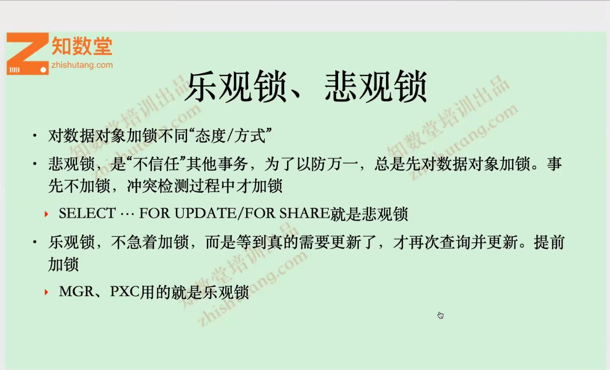  
  
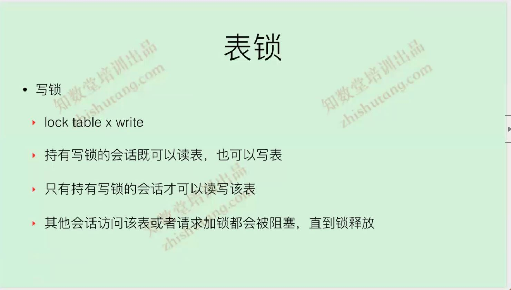  
  
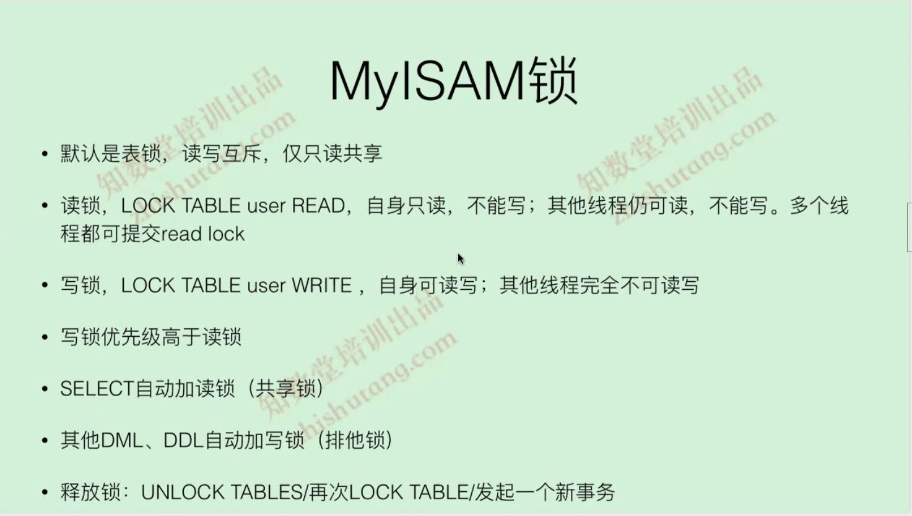  
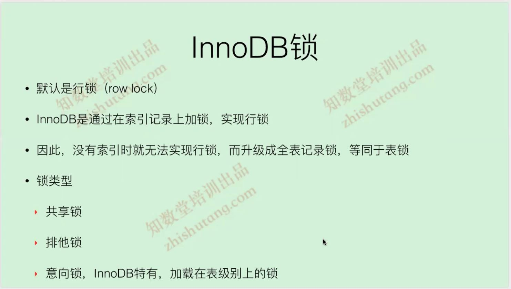  
  
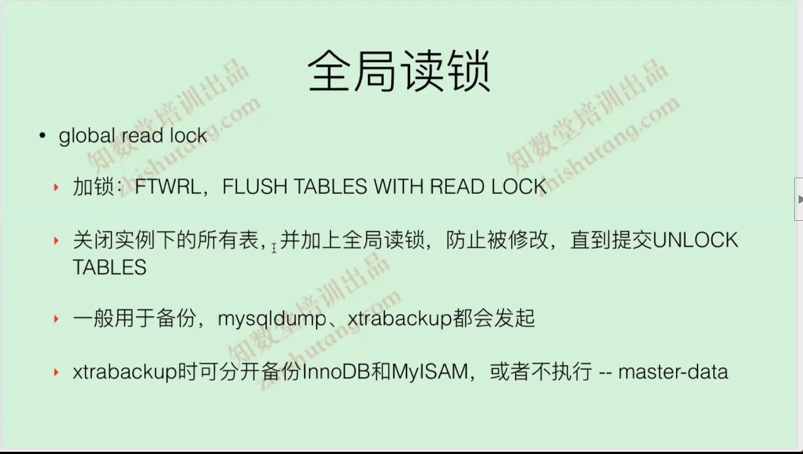  
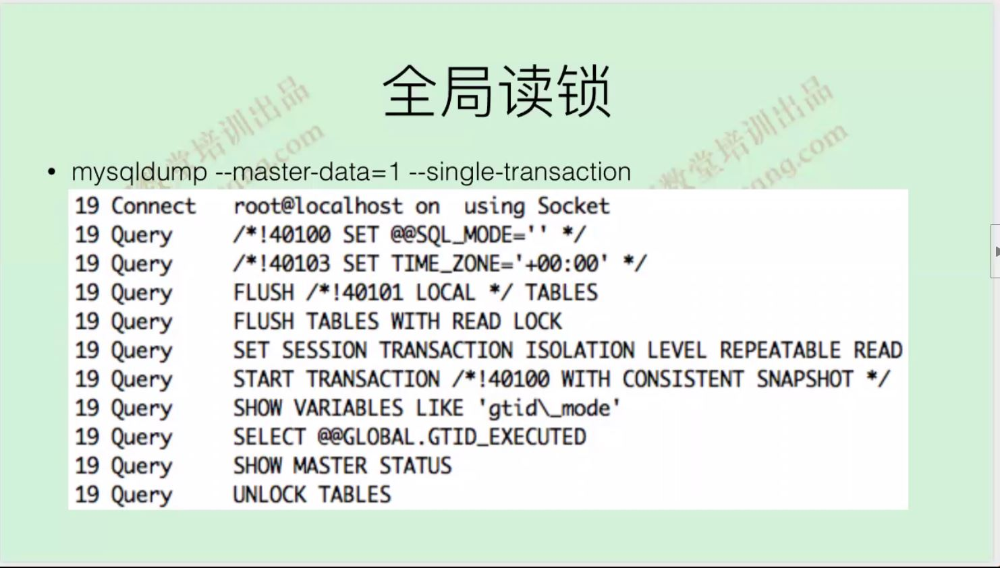  
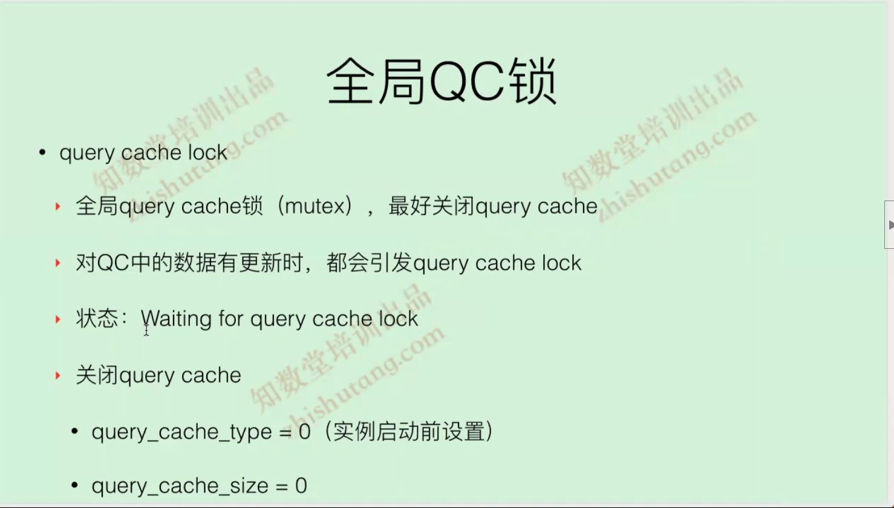    
清除QC:reset query cache或者flush tables  
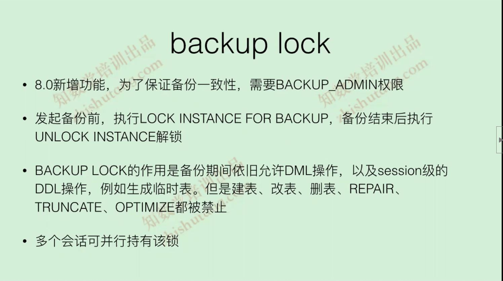   
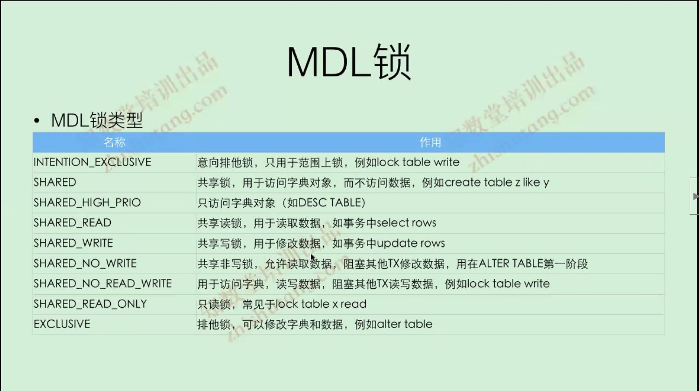  
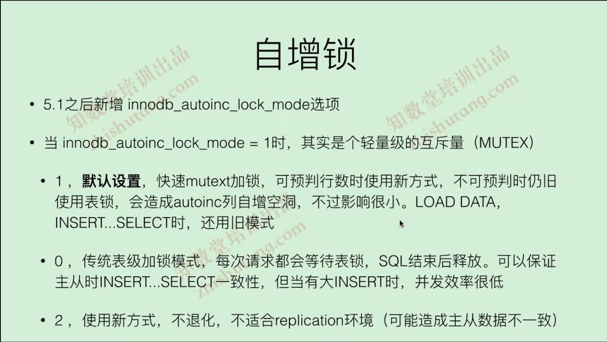   
  
innodb_autoinc_lock_mode=2时候binlog_format=row需要设置row格式不然很可能导致主从不一致
innodb_rollback_on_timeout=0|1  等待锁超时,sql回滚还是整个事务回滚
innodb_status_output_locks=1, 在show engine innodb status 中输出锁相关信息
自旋锁OS waits较大,检查一下buffer bool是否够用或者否很多sql没有使用索引